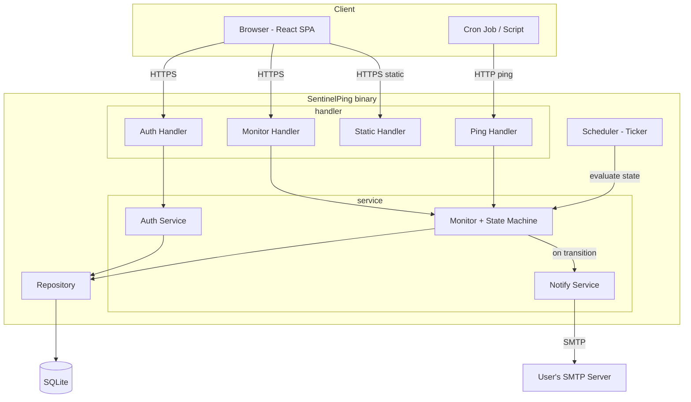
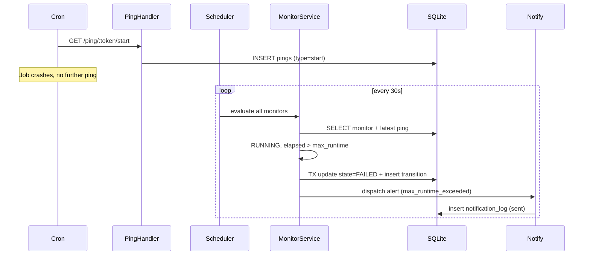

# Blueprint Document

Blueprint Version: 1.0
Project Name: SentinelPing
Architecture Style: Monolith
System Scope: MVP — single-node, single-binary, self-hosted job monitoring

---

## 1. Context Lock

- Runtime: Go 1.22+ (EXACT_VERSION: minimum 1.22, for stdlib slices/maps
  support).
- Database: SQLite (file-based), driver `modernc.org/sqlite`.
- ORM: PROHIBITED. MUST use raw SQL via `database/sql` with prepared
  statements.
- Allowed Libraries:
  - `github.com/go-chi/chi/v5` (HTTP router).
  - `modernc.org/sqlite` (DB driver, CGO-free, REQUIRED).
  - `golang.org/x/crypto/bcrypt` (password hashing, REQUIRED).
  - `github.com/golang-jwt/jwt/v5` OR stdlib session cookie (session
    strategy locked in Section 5).
  - Go stdlib: `net/smtp`, `net/http`, `html/template`, `embed`, `time`,
    `context`.
- Forbidden Libraries:
  - Any ORM (GORM, ent, sqlx-with-struct-mapping-magic) — PROHIBITED.
  - Any external job queue (Redis, RabbitMQ, Kafka) — PROHIBITED for MVP.
  - Any microframework replacing stdlib `net/http` core behavior —
    NOT_ALLOWED beyond routing (chi is router-only, not a framework).
- Dependency Direction: `handler -> service -> repository -> database`.
  MUST NOT skip layers. MUST NOT call repository directly from handler.

---

## 2. Architectural Boundaries

- Layers:
  1. `handler` (HTTP layer: request parsing, response writing, status
     codes).
  2. `service` (business logic: state machine, validation, orchestration).
  3. `repository` (SQL queries, no business logic).
  4. `scheduler` (background checker loop, calls into `service`).
- Allowed Call Flow:
  - `handler -> service`
  - `service -> repository`
  - `scheduler -> service`
- Forbidden Call Flow:
  - `handler -> repository` (PROHIBITED — bypasses business logic).
  - `repository -> service` (PROHIBITED — inverted dependency).
  - `scheduler -> repository` (PROHIBITED — scheduler MUST go through
    service layer for state transitions).
- Cross-layer Rules:
  - `service` layer MUST NOT import `net/http`.
  - `repository` layer MUST NOT contain conditional business logic (e.g.
    state transition decisions) — STRICT: only CRUD + query composition.
  - Frontend static assets MUST be served via Go `embed.FS`, mounted at
    root path by `handler` layer only.

---

## 3. Data Model Contract

- Normalization Level: 3NF.
- Table Definitions:

```sql
-- users
id            INTEGER PRIMARY KEY AUTOINCREMENT
email         TEXT NOT NULL UNIQUE
password_hash TEXT NOT NULL
smtp_host     TEXT
smtp_port     INTEGER
smtp_username TEXT
smtp_password TEXT   -- STRICT: MUST be encrypted at rest (Section 5)
smtp_from     TEXT
created_at    TEXT NOT NULL  -- ISO8601

-- monitors
id               INTEGER PRIMARY KEY AUTOINCREMENT
user_id          INTEGER NOT NULL REFERENCES users(id) ON DELETE CASCADE
name             TEXT NOT NULL
ping_token       TEXT NOT NULL UNIQUE  -- opaque, MUST be >=32 char random
expected_interval_seconds INTEGER NOT NULL
grace_period_seconds      INTEGER NOT NULL
max_runtime_seconds       INTEGER NOT NULL
current_state    TEXT NOT NULL  -- enum, see Section 4
last_state_change_at TEXT
created_at       TEXT NOT NULL
paused           INTEGER NOT NULL DEFAULT 0  -- boolean 0/1

-- pings
id           INTEGER PRIMARY KEY AUTOINCREMENT
monitor_id   INTEGER NOT NULL REFERENCES monitors(id) ON DELETE CASCADE
ping_type    TEXT NOT NULL  -- 'start' | 'success' | 'fail'
received_at  TEXT NOT NULL
source_ip    TEXT

-- state_transitions
id            INTEGER PRIMARY KEY AUTOINCREMENT
monitor_id    INTEGER NOT NULL REFERENCES monitors(id) ON DELETE CASCADE
from_state    TEXT NOT NULL
to_state      TEXT NOT NULL
transitioned_at TEXT NOT NULL
reason        TEXT NOT NULL  -- e.g. 'grace_period_exceeded', 'fail_ping_received'

-- notification_log
id           INTEGER PRIMARY KEY AUTOINCREMENT
monitor_id   INTEGER NOT NULL REFERENCES monitors(id) ON DELETE CASCADE
attempted_at TEXT NOT NULL
status       TEXT NOT NULL  -- 'sent' | 'failed'
error_detail TEXT
```

- Index Policy:
  - `monitors.ping_token` MUST have UNIQUE index (lookup path for public
    ingestion endpoint).
  - `pings.monitor_id` MUST have index (history query pattern).
  - `pings(monitor_id, received_at)` MUST have composite index (latest-ping
    lookup, used every check cycle).
  - `state_transitions.monitor_id` MUST have index.
- Constraint Policy:
  - All foreign keys MUST use `ON DELETE CASCADE`.
  - `ping_type` MUST be constrained via `CHECK` clause to the 3 allowed
    values.
  - `current_state` MUST be constrained via `CHECK` clause to the 5 allowed
    values (Section 4).
- Denormalization Policy:
  - `monitors.current_state` and `monitors.last_state_change_at` ARE
    denormalized (derivable from `state_transitions` + `pings`) —
    JUSTIFIED: avoids full history scan on every dashboard read. MUST be
    kept in sync exclusively by `service` layer state machine writes,
    inside the same transaction as any `state_transitions` insert.

---

## 4. Execution Constraints

- Async Policy:
  - Checker cycle MUST run in a single dedicated goroutine using
    `time.Ticker`. STRICT: MUST NOT spawn one goroutine per monitor — MUST
    process all monitors in one sequential pass per tick (deterministic,
    bounded execution time per Success Metrics).
  - Email dispatch MUST run in a separate goroutine pool with MAX_LIMIT 5
    concurrent SMTP connections, to prevent checker cycle blocking on slow
    SMTP servers.
- Transaction Policy:
  - Every state transition (state machine write) MUST occur inside a single
    SQL transaction covering: `monitors` update + `state_transitions`
    insert. STRICT: partial writes PROHIBITED.
  - Ping ingestion write (`pings` insert) MUST NOT be wrapped in the same
    transaction as state evaluation — ingestion MUST be fast-path, state
    evaluation happens on next checker tick, NOT synchronously on ping
    receipt.
- Logging Policy:
  - MUST use structured logging (`log/slog`, JSON format).
  - REQUIRED fields per log entry: `timestamp`, `level`, `component`,
    `monitor_id` (if applicable), `message`.
  - Checker cycle MUST log start/end of every tick with monitor count
    processed and duration.
- Error Handling Policy:
  - `service` layer MUST return typed errors (custom error types), NOT raw
    strings.
  - `handler` layer MUST map service errors to HTTP status codes via a
    single centralized error-mapping function. STRICT: MUST NOT scatter
    status code decisions across individual handlers.
  - Panics in checker goroutine MUST be recovered (`defer recover()`) at
    the tick level — a single monitor's processing error MUST NOT crash the
    entire checker loop or skip remaining monitors in that tick.
- Validation Policy:
  - All user-supplied input (monitor config, signup fields) MUST be
    validated in `service` layer before persistence.
  - `expected_interval_seconds`, `grace_period_seconds`,
    `max_runtime_seconds` MUST be positive integers, MAX_LIMIT 2592000 (30
    days) each.

---

## 5. Integration Contracts

- Module Rules:
  - `internal/auth` — signup, login, session/token issuance. MUST NOT be
    imported by `internal/monitor` (auth is a dependency of handler layer
    only, via middleware).
  - `internal/monitor` — monitor CRUD + state machine logic.
  - `internal/ping` — ping ingestion logic (separate from monitor CRUD to
    isolate the public unauthenticated endpoint surface).
  - `internal/notify` — email dispatch.
  - `internal/scheduler` — checker loop orchestration.
- File Rules:
  - Frontend build output MUST be placed at `web/dist` and embedded via
    `//go:embed web/dist` in a single `embed.go` file at repository root.
  - Database migrations MUST live in `internal/db/migrations/` as
    sequentially numbered `.sql` files (STRICT: no migration framework
    beyond a minimal runner — PROHIBITED to add golang-migrate or similar
    as a hard dependency; a simple embedded-SQL runner MUST be
    hand-written).
- External Service Rules:
  - SMTP is the ONLY external service integration in MVP. MUST support
    STARTTLS. MUST NOT hardcode any specific SMTP provider.
  - No other third-party API calls are PERMITTED in MVP scope.
- Security Rules:
  - Passwords MUST be hashed with bcrypt, cost factor MIN 10.
  - `smtp_password` field MUST be encrypted at rest using AES-256-GCM with
    a server-side secret key (from environment variable, MUST NOT be
    committed to repository).
  - Session strategy: HTTP-only, Secure, SameSite=Lax cookie containing a
    signed session token. MUST NOT use `localStorage` for session storage.
  - Ping ingestion endpoint MUST NOT require authentication (token in URL
    IS the auth mechanism) but MUST validate token format before any DB
    query (STRICT: reject malformed tokens with 400 before hitting
    database, to reduce injection/enumeration surface).
  - Ping token MUST be generated using `crypto/rand`, NOT `math/rand`.

---

## 6. Verification Rules

### State Machine Definition (STRICT — the following 5 states are EXHAUSTIVE)

```
States: PENDING | HEALTHY | RUNNING | LATE | FAILED

PENDING: initial state, no ping ever received.
HEALTHY: last received ping was 'success', within expected_interval + grace_period.
RUNNING: last received ping was 'start', within max_runtime_seconds.
LATE:    no ping received within expected_interval + grace_period since last success.
FAILED:  either (a) 'fail' ping explicitly received, or
         (b) 'start' ping received but no 'success'/'fail' within max_runtime_seconds.
```

### Acceptance Scenarios

1. GIVEN a new monitor with no pings, WHEN checker runs, THEN state MUST
   remain `PENDING`.
2. GIVEN monitor in `PENDING`, WHEN a `success` ping arrives, THEN state
   MUST transition to `HEALTHY` immediately on next checker tick.
3. GIVEN monitor in `HEALTHY`, WHEN a `start` ping arrives, THEN state MUST
   transition to `RUNNING`.
4. GIVEN monitor in `RUNNING`, WHEN a `success` ping arrives before
   `max_runtime_seconds` elapses, THEN state MUST transition to `HEALTHY`.
5. GIVEN monitor in `RUNNING`, WHEN `max_runtime_seconds` elapses with no
   terminal ping, THEN state MUST transition to `FAILED` with reason
   `max_runtime_exceeded`.
6. GIVEN monitor in `HEALTHY`, WHEN `expected_interval_seconds +
   grace_period_seconds` elapses with no new `start` ping, THEN state MUST
   transition to `LATE`.
7. GIVEN monitor in ANY state, WHEN a `fail` ping arrives, THEN state MUST
   transition to `FAILED` with reason `fail_ping_received` REGARDLESS of
   prior state.
8. GIVEN monitor transitions into `LATE` or `FAILED`, THEN exactly one
   notification dispatch attempt MUST be enqueued (STRICT: MUST NOT
   re-notify on every subsequent checker tick while remaining in the same
   failing state — notify ONLY on state transition edge, not state
   persistence).

### Failure Scenarios

1. GIVEN SMTP delivery fails, WHEN checker has already transitioned monitor
   state, THEN the state transition MUST persist regardless of
   notification outcome (state truth MUST NOT depend on notification
   success).
2. GIVEN checker process restarts, WHEN it resumes, THEN it MUST NOT
   re-send notifications for state transitions that occurred before
   restart (state is derived from persisted `current_state`, not
   in-memory).
3. GIVEN two pings arrive within the same second for the same monitor,
   THEN both MUST be persisted in `pings` table (STRICT: no deduplication
   at ingestion layer — state machine evaluation always uses
   most-recent-by-timestamp).

### Non-goals

- Multi-node checker coordination (leader election, distributed locks).
- Sub-second check granularity (tick interval MUST be configurable,
  DEFAULT 30s, MIN_LIMIT 10s).
- Historical state machine replay / backfill.

### Out-of-Scope

- Any notification channel other than email.
- Any auth mechanism other than session cookie (no OAuth/SSO/API keys).

---

# A. Architecture Diagram



---

# B. Component Responsibility Matrix

| Component | Responsibility | Scenario Supported |
|---|---|---|
| Auth Handler/Service | Signup, login, session issuance | User account creation and access control |
| Monitor Handler/Service | CRUD for monitors, state machine evaluation | Creating monitors, viewing status, deleting monitors |
| Ping Handler | Accept unauthenticated start/success/fail pings | Cron job reporting lifecycle events |
| Scheduler | Periodic tick, invokes state evaluation across all monitors | Detecting late/failed monitors without a triggering ping |
| Notify Service | Dispatch email on state transition into failing state | Alerting user of silent failures |
| Repository | Raw SQL access, no business logic | Data persistence for all above |
| Static Handler | Serve embedded React build | Dashboard UI delivery |

No component exists without a mapped scenario above.

---

# C. Data Contracts

- Entities: `User`, `Monitor`, `Ping`, `StateTransition`, `NotificationLog`.
- Relationships: `User 1--N Monitor`, `Monitor 1--N Ping`, `Monitor 1--N
  StateTransition`, `Monitor 1--N NotificationLog`.
- Ownership Boundaries: A `Monitor` MUST belong to exactly one `User`. All
  monitor-scoped queries MUST filter by `user_id` at the repository layer
  to enforce tenant isolation (STRICT: no cross-user data leakage path
  permitted).
- Required Fields: see Section 3 table definitions — all NOT NULL columns
  are REQUIRED at insert time; service layer MUST reject incomplete
  payloads before reaching repository.

---

# D. End-to-End Dry Run

## Scenario: Job Fails Silently, User Gets Alerted



---

# E. Internal Contracts

## Ping Ingestion Contract

`GET /ping/:token/{start|success|fail}` — 200 `{"status":"recorded"}` · 400
`{"error":"invalid_token_format"}` · 404 `{"error":"monitor_not_found"}`.

## Monitor API Contract

```json
POST /api/monitors
Request: {"name":"nightly-db-backup","expected_interval_seconds":86400,
  "grace_period_seconds":3600,"max_runtime_seconds":1800}
Response 201: {"id":42,"name":"nightly-db-backup","ping_token":"a1b2c3...",
  "current_state":"PENDING","created_at":"2026-07-07T10:00:00Z"}
```

## Error Contract (Global)

`{"error":"string_error_code","message":"human readable"}` — STRICT: all
handler error responses MUST conform to this shape. Status codes: 400
(validation), 401 (unauthenticated), 403 (cross-tenant), 404 (not found),
500 (internal).

## Security Contract

All `/api/*` routes except `/api/auth/signup` and `/api/auth/login` MUST
require valid session cookie. All `/ping/*` routes MUST NOT require it.
CORS MUST be disabled (same-origin only, single binary serves both).

## Retry/Timeout Policy

SMTP send MUST timeout at 10s/attempt, MAX_LIMIT 3 retries, backoff 2s/4s/8s,
then mark `notification_log.status=failed`. HTTP server `ReadTimeout` and
`WriteTimeout` MUST be 15s.

## Event Contract

Every state transition MUST produce exactly one `state_transitions` row.
Notification dispatch MUST trigger ONLY when `to_state` IN (`LATE`,
`FAILED`).

## Logging Contract

`{"timestamp":"...","level":"info","component":"scheduler","monitor_id":42,
"message":"state transition: RUNNING -> FAILED (max_runtime_exceeded)"}`

## Testing Contract

`service` state machine MUST have unit tests covering all 8 Acceptance
Scenarios (Section 6) — no transition path merges without a test.
`repository` MUST be tested against in-memory SQLite (`:memory:`), NOT
mocked interfaces.

## Versioning Contract

API is unversioned (`/api/*`, no `/v1/`) — JUSTIFIED: single frontend
consumer. Versioning is a Non-Goal per PRD.md.
